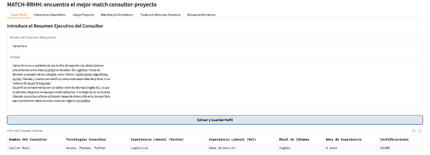

# Aplicación de Matching de Consultores

## 1. Descripción del Proyecto

Esta aplicación web interactiva, construida con Gradio, está diseñada para facilitar el proceso de *matching* entre consultores y proyectos. Su objetivo principal es automatizar la extracción de información clave de los resúmenes ejecutivos de los consultores y permitir a los usuarios definir los requisitos de los proyectos. Con base en esta información estructurada, la aplicación calcula un score de compatibilidad, presentando los resultados de manera clara y justificada.

### ¿Qué hace?
*   **Extracción de Perfiles de Consultores:** A partir de un resumen ejecutivo en texto libre, la aplicación extrae automáticamente datos como tecnologías conocidas, experiencia laboral (sector y rol), nivel de idiomas, años de experiencia y certificaciones.
*   **Gestión de Proyectos:** Permite definir y almacenar los requisitos específicos de los proyectos (rol, tecnologías, sector, idiomas, experiencia, certificaciones).
*   **Cálculo de Matching:** Evalúa la compatibilidad de cada consultor con un proyecto seleccionado, asignando un score porcentual.
*   **Justificación Detallada:** Genera una tabla comparativa visualmente enriquecida que resalta las coincidencias entre las habilidades del consultor y los requisitos del proyecto, facilitando la toma de decisiones.
*   **Búsqueda Semántica:** Permite buscar consultores utilizando consultas en lenguaje natural, encontrando a los más relevantes basándose en la similitud semántica de sus perfiles.
*   **Traducción de Resúmenes:** Ofrece la funcionalidad de traducir el resumen ejecutivo del consultor con el mejor *matching* a otros idiomas (inglés, en este caso).

### ¿Por qué es útil?
Esta herramienta optimiza el tiempo en la selección de personal para proyectos, reduce el sesgo en la evaluación de candidatos y proporciona una justificación objetiva para las decisiones de *staffing*. Es ideal para consultoras, empresas de reclutamiento o departamentos de gestión de proyectos que buscan una forma eficiente y estructurada de gestionar sus recursos humanos.

## 2. Tecnologías Utilizadas

La aplicación se basa en una combinación de librerías de Python para procesamiento de lenguaje natural, interfaz de usuario y manejo de datos:

*   **Gradio:** Framework principal para la construcción de la interfaz de usuario web interactiva.
*   **Hugging Face Transformers:** Se utiliza para la traducción de texto (modelo `Helsinki-NLP/opus-mt-es-en`).
*   **Sentence-Transformers:** Esencial para la funcionalidad de búsqueda semántica, generando embeddings vectoriales de los textos (modelo `sentence-transformers/paraphrase-multilingual-MiniLM-L12-v2`).
*   **Pandas:** Utilizado extensivamente para el manejo y manipulación de datos, especialmente para la creación y visualización de DataFrames.
*   **Scikit-learn (sklearn.metrics.pairwise.cosine_similarity):** Empleado para calcular la similitud coseno entre los embeddings.
*   **JSON y Python `os`:** Utilizados para la persistencia de datos (perfiles de consultores y proyectos) en archivos locales.
*   **Python `re` (Regular Expressions) y `unicodedata`:** Fundamentales para la extracción de información estructurada y normalización de texto.

### Librerías de Python Requeridas (`requirements.txt`)

```
gradio
transformers==5.8.0
pandas==2.2.2
sentence-transformers
torch
scikit-learn
sacremoses
sentencepiece
```

## 3. Instrucciones de Instalación y Ejecución Local

Para instalar y ejecutar la aplicación de Gradio en tu entorno local, sigue los siguientes pasos:

1.  **Clonar el Repositorio (si aplica):**
    ```bash
    git clone <URL_DEL_REPOSITORIO>
    cd <NOMBRE_DEL_REPOSITORIO>
    ```

2.  **Crear un Entorno Virtual (Recomendado):**
    ```bash
    python -m venv venv
    ```

3.  **Activar el Entorno Virtual:**
    *   **Windows:**
        ```bash
        .\venv\Scripts\activate
        ```
    *   **macOS/Linux:**
        ```bash
        source venv/bin/activate
        ```

4.  **Instalar las Dependencias:**
    ```bash
    pip install -r requirements.txt
    ```

5.  **Configurar el Token de Hugging Face (Opcional pero Recomendado):**
    Establece tu `HF_TOKEN` como una variable de entorno si trabajas con modelos privados o sujetos a tasa:
    ```bash
    export HF_TOKEN="tu_token_de_huggingface"
    # Para Windows (PowerShell):
    # $env:HF_TOKEN="tu_token_de_huggingface"
    ```

6.  **Ejecutar la Aplicación Gradio:**
    Navega al directorio donde se encuentra tu script principal (por ejemplo, `app.py`). Luego, ejecuta el script de Python:
    ```bash
    python app.py
    ```
    Abre la URL que Gradio proporcione (usualmente `http://127.0.0.1:7860/`) en tu navegador.

## 4. Link a la Aplicación Desplegada

La aplicación está desplegada en Hugging Face Spaces y se puede acceder aquí:

[https://huggingface.co/spaces/gustavodgomez/HR-Match](https://huggingface.co/spaces/gustavodgomez/HR-Match)

## 5. Capturas de Pantalla de la Aplicación Funcionando



